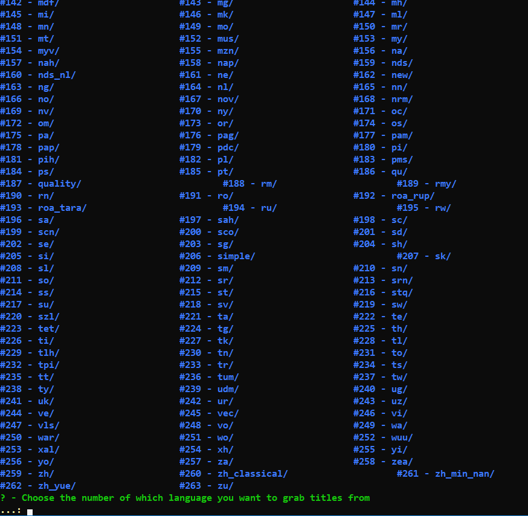
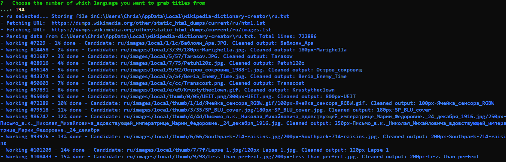

# wiki-dictionary-creator
Allows you to select a language from Wikipedia.com and create wordlists based on all articles represented in that language. 

Works great with password cracking and word mangling rules. 

TODO:
- Parameters
- Not just titles, but also articles 
